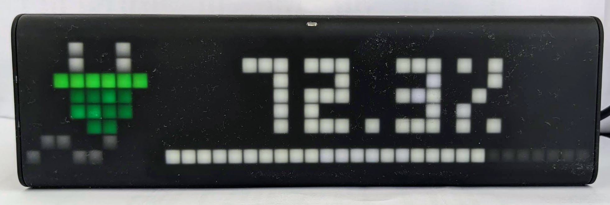
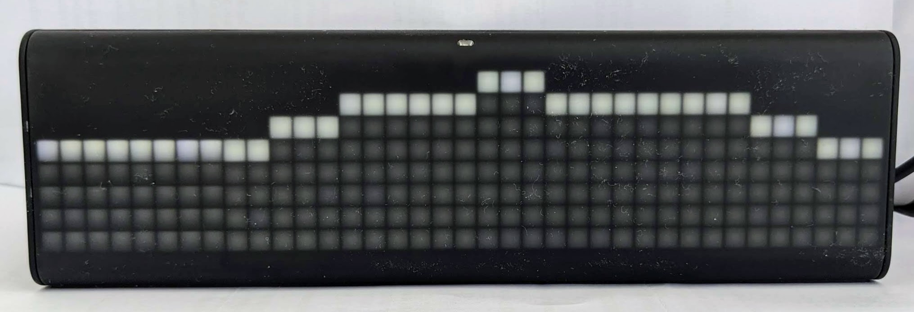

# Share of Renewable Energy on LaMetric

This project defines an application for [LaMetric](https://lametric.com/) Smart Clocks to visualize the current share of renewable energy in the electricity grid and an outlook for the next 10 hours.

The application can be found in the [LaMetric Market](https://apps.lametric.com/?product=market).

## How it works

The service provides an API GET endpoint under `/api/frames?country=<country>` which fetches the renewable share data from [Energy Charts Signal API](https://api.energy-charts.info/#/ren_share/traffic_signal_signal_get).
The data is then transformed into two frames:

- Frame 1: Shows the current share of renewable energy as a number, a status indicator between 0 and 100%, along with an icon in green, yellow or red.
- Frame 2: Shows the progress of the share of renewable energy for the next 10 hours starting from now.

## Getting Started

### Prerequisites

- Node.js 16+
- npm
- [Wrangler CLI](https://developers.cloudflare.com/workers/wrangler/)
- LaMetric Smart Clock

### Install

`npm install`

### Running locally

`npx wrangler dev`

## Deploy

`npx wrangler deploy`

## Supported Countries

- de - Germany
- ch - Switzerland
- at - Austria
- be - Belgium
- bg - Bulgaria
- cz - Czech Republic
- dk - Denmark
- ee - Estonia
- es - Spain
- fi - Finland
- fr - France
- gr - Greece
- hr - Croatia
- hu - Hungary
- it - Italy
- lt - Lithuania
- lu - Luxembourg
- lv - Latvia
- me - Montenegro
- mk - North Macedonia
- nl - Netherlands
- no - Norway
- pl - Poland
- pt - Portugal
- ro - Romania
- se - Sweden
- si - Slovenia
- sk - Slovak Republic

## Contributing

Contributions are welcome! If you'd like to add support for more countries or improve the visualization, please fork the repository and submit a pull request.

## License

This project is licensed under the MIT License. See the LICENSE file for details.

## Acknowledgments

- [LaMetric](https://lametric.com/) for their innovative smart clock platform
- [Energy Charts](https://energy-charts.info/) for providing the renewable energy data API
- [Google Gemini](https://gemini.google.com/) for code generation, review and improvements
- Open source contributors for their invaluable support and feedback
